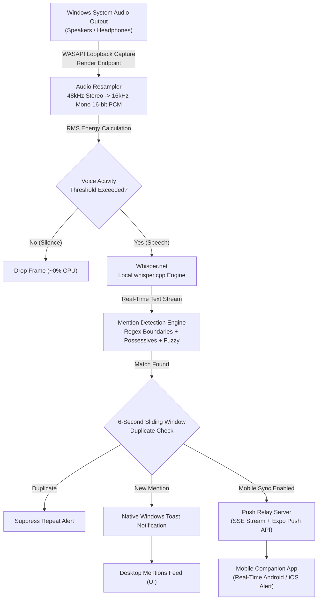

# MentionedMe

A privacy-focused, lightweight Windows desktop and mobile companion application that continuously monitors system audio output in real-time to alert you instantly whenever your name or aliases are spoken.

[]()
[]()
[]()
[]()
[](LICENSE)

---

## Overview

**MentionedMe** solves the challenge of missed context and distractions during long virtual meetings, webinars, conferences, and multi-tasking sessions. Whether you are muted on Zoom, Microsoft Teams, Google Meet, Slack Huddle, or Discord, or you have stepped away from your desk, MentionedMe ensures you never miss a colleague addressing you.

- **What MentionedMe Does**: MentionedMe captures speaker and headphone audio output directly via Windows WASAPI loopback, runs high-speed on-device speech-to-text with local Whisper models, detects occurrences of your name or nicknames with phonetic and possessive-aware matching, and notifies you immediately via Windows toast alerts and optional real-time mobile push notifications.
- **The Problem It Solves**: Attending hours of calls often leads to divided attention, backgrounding meetings while coding, or stepping away to grab coffee. Traditional meeting bots require intrusive calendar invites, record entire meetings to the cloud, or compromise corporate privacy policies.
- **Why It Exists**: To provide an entirely local, zero-cloud-audio solution that respects privacy. MentionedMe never touches your microphone, never records your room, and processes all audio incrementally in volatile RAM.
- **Who It Is For**: Remote workers, software engineers, hybrid professionals, students, and anyone who wants passive, reliable background call monitoring without privacy trade-offs.

---

## Features

- **Zero Microphone Access**: Captures only rendered system/speaker audio via Windows WASAPI Loopback (`DataFlow.Render`). Your microphone and physical room are never accessed or recorded.
- **100% Local On-Device Speech Recognition**: Powered by `Whisper.net` and `whisper.cpp` using lightweight Whisper models (`ggml-base.en` / `ggml-tiny.en`). Audio is transcribed entirely on your CPU in RAM—no audio or transcripts are transmitted to any cloud service.
- **Voice Activity Detection (VAD) Gating**: Computes real-time RMS energy levels on 16kHz mono audio frames. Silent periods bypass transcription entirely, maintaining near 0% idle CPU consumption.
- **Intelligent Name & Alias Detection**:
  - Matches primary names and up to 4 customizable nicknames or aliases (e.g., `Srinath`, `Sri`, `Srini`).
  - Strict word-boundary regex (`\bname\b`) to prevent false positives from sub-words (e.g., `Dan` will not trigger on `dangerous` or `guidance`).
  - Automatic possessive handling (`Srinath's`).
  - High-precision single-word and two-word fuzzy matching with strict length guards (Levenshtein distance &le; 1).
- **Smart Sliding-Window Deduplication**: 6-second deduplication buffer prevents duplicate notifications caused by overlapping transcription windows on the same spoken sentence.
- **Native Windows Toast Notifications**: Instant rich Windows alerts displaying the matched name, exact sentence in context, and timestamp with quick navigation back to the app.
- **Dynamic VU Audio Visualizer**: Live decibel/RMS meter dynamically animates with system sound so you always know audio capture is functioning properly.
- **Live Transcription Drawer**: Optional real-time transcript inspector with one-click copy to clipboard for verifying transcription fidelity.
- **Mobile Companion Sync (Wi-Fi & Push)**:
  - Simple 4-digit pairing code workflow (`MM-XXXX`).
  - Local LAN Server-Sent Events (SSE) stream for sub-second live updates.
  - Remote push notification dispatching via a lightweight Node.js relay using Expo Push Notifications.
- **Modern Windows 11 Dark UI**: Built with WPF-UI featuring dark glassmorphism, responsive status badges, pinned Always-on-Top mode, and hotkey support.

---

## Screenshots / Demo

> Screenshots coming soon.

---

## Architecture

MentionedMe is designed as a modular ecosystem comprising a high-performance Windows desktop client, an optional push relay backend, and a cross-platform mobile companion application:

```
MentionedMe/
├── MentionedMe.csproj          # .NET 8 WPF Desktop Client
├── App.xaml / App.xaml.cs      # WPF Application entry & lifecycle
├── MainWindow.xaml / .cs       # Main UI window (Dark Fluent UI, VU meter, Mentions feed)
├── Models/                     # Data models (AppSettings, MentionItem, ListeningState)
├── Services/                   # Core business logic & audio engine
│   ├── WasapiLoopbackService   # Loopback audio capture from default output endpoint
│   ├── AudioResampler          # Resampling (48kHz stereo -> 16kHz mono 16-bit PCM) & RMS calculation
│   ├── WhisperTranscription    # whisper.cpp transcription pipeline
│   ├── MentionDetectionService # Regex, phonetic matching, and sliding deduplication
│   ├── WindowsNotification     # Microsoft.Toolkit.Uwp native toast notification integration
│   ├── ModelDownloadService    # Automated Whisper model downloader with progress tracking
│   ├── MobileNotification      # HTTP client for pairing, SSE sync, and relay dispatching
│   └── UserSettingsService     # Persistent JSON settings (%LOCALAPPDATA%/MentionedMe)
├── ViewModels/                 # MVVM presentation layer (MainViewModel, RelayCommand)
├── tests/                      # Automated test suite
│   └── MentionedMe.Tests/      # xUnit tests for AudioResampler, Detection, and Whisper
├── relay/                      # Lightweight Node.js / Express push relay server
│   ├── server.js               # REST & SSE server (pairing protocol, push dispatching)
│   ├── package.json            # Relay dependencies & scripts
│   └── data/                   # Relay runtime data directory
└── mobile/                     # React Native / Expo companion mobile app
    ├── App.tsx                 # Mobile UI, pairing manager, and notification listener
    ├── app.json                # Expo application configuration
    ├── package.json            # Mobile dependencies & scripts
    └── src/                    # Components & storage/push services
```

### Component Responsibilities

1. **Desktop Client (`MentionedMe`)**:
   - Captures system audio from speakers/headphones via NAudio WASAPI loopback.
   - Converts audio to 16kHz mono PCM and applies RMS energy thresholding.
   - Passes active speech chunks to `Whisper.net` running locally on-device.
   - Evaluates transcripts against target names and triggers desktop toast notifications.
   - Forwards detected mention payloads to the Relay Server if mobile sync is enabled.

2. **Push Relay Server (`relay/`)**:
   - Manages device pairing codes (`MM-XXXX`) between the desktop and mobile clients.
   - Dispatches Server-Sent Events (SSE) across the local Wi-Fi network for instantaneous updates.
   - Dispatches remote push notifications via the Expo Push Notification service.

3. **Mobile Companion App (`mobile/`)**:
   - Generates pairing codes and stores persistent connection state via AsyncStorage.
   - Receives remote push notifications when away from the desktop.
   - Displays a live card feed of recent mentions with timestamps and spoken context.

---

## Tech Stack

- **Desktop Application**:
  - Language: C# 12
  - Framework: .NET 8 (`net8.0-windows10.0.19041.0`, WPF)
  - Audio Engine: NAudio 2.2.1 (`NAudio.Wasapi`, `NAudio.Core`)
  - Speech Recognition: Whisper.net 1.9.1 (`whisper.cpp` native runtime)
  - UI Library: WPF-UI 4.3.0
  - Notifications: Microsoft.Toolkit.Uwp.Notifications 7.1.3
- **Relay Backend**:
  - Runtime: Node.js (18+)
  - Web Framework: Express 4.19
  - Networking: CORS, Server-Sent Events (SSE), standard HTTP fetch
  - Push Service: Expo Server Push API
- **Mobile Application**:
  - Framework: React Native 0.81, Expo SDK 54
  - Language: TypeScript 5.9
  - State & Storage: React Hooks, `@react-native-async-storage/async-storage`
  - Platform Services: `expo-notifications`, `expo-device`, `expo-haptics`, `expo-clipboard`
- **Testing**:
  - Framework: xUnit 2.5.3
  - Test Runner: Microsoft.NET.Test.Sdk 17.8.0
  - Code Coverage: Coverlet Collector 6.0.0
- **Build Tools**:
  - MSBuild / .NET CLI
  - npm / npx

---

## Requirements

To run or build MentionedMe locally, ensure the following tools are installed on your workstation:

### For Desktop & Tests
- **Operating System**: Windows 10 (version 1809 or higher, build 17763+) or Windows 11
- **.NET SDK**: [.NET 8.0 SDK](https://dotnet.microsoft.com/download/dotnet/8.0) (SDK 8.0.400 or higher recommended)
- **Audio Device**: Any working audio output device (speakers, headphones, virtual audio cable)

### For Relay Server & Mobile (Optional)
- **Node.js**: v18.0.0 or higher
- **npm**: v9.0.0 or higher
- **Expo Go App** (optional, for running the mobile app on a physical Android or iOS device)

---

## Installation

### 1. Clone the Repository

```bash
git clone https://github.com/Srinath318/MentionedMe_Desktop.git
cd MentionedMe_Desktop
```

### 2. Restore Desktop Dependencies

```bash
dotnet restore MentionedMe.csproj
```

### 3. (Optional) Install Relay Server Dependencies

```bash
cd relay
npm install
cd ..
```

### 4. (Optional) Install Mobile App Dependencies

```bash
cd mobile
npm install
cd ..
```

---

## Running the Application

### Running the Desktop App

#### Option A: Quick Launcher (Batch Script)
Double-click `run.bat` or run from PowerShell:
```powershell
.\run.bat
```

#### Option B: .NET CLI
```powershell
dotnet run --project MentionedMe.csproj -c Release
```

#### Option C: Build and Run Standalone Binary
```powershell
dotnet build MentionedMe.csproj -c Release
.\bin\Release\net8.0-windows10.0.19041.0\MentionedMe.exe
```

*Note on First Launch: When you first click "Start Listening", MentionedMe will automatically download the Whisper speech recognition model (`ggml-base.en.bin`, ~142 MB) to `%LOCALAPPDATA%/MentionedMe/models`. This is a one-time process.*

---

### Running the Relay Server (For Mobile Companion)

```bash
cd relay
npm start
```
By default, the relay server listens on port `3000` (`http://localhost:3000`). To specify a different port:
```bash
PORT=3001 npm start
```

---

### Running the Mobile Companion App

```bash
cd mobile
npx expo start
```
Scan the displayed QR code with the **Expo Go** application on your mobile device (or press `a` for Android Emulator, `i` for iOS Simulator, or `w` for Web).

---

## Running Automated Tests

The solution includes automated unit tests covering audio resampling, sentence boundary analysis, possessive matching, fuzzy phonetic detection, deduplication, and model loading:

```powershell
dotnet test tests\MentionedMe.Tests\MentionedMe.Tests.csproj
```

To run tests with detailed diagnostic verbosity:
```powershell
dotnet test tests\MentionedMe.Tests\MentionedMe.Tests.csproj --logger "console;verbosity=detailed"
```

---

## How It Works



1. **Audio Capture**: Captures speaker output without intercepting or modifying Windows audio routing.
2. **Audio Preprocessing**: Converts variable sample rate stereo streams into standardized 16kHz 16-bit mono PCM chunks required by Whisper.
3. **Energy Gating**: Discards frames where RMS volume is below the configured sensitivity threshold.
4. **Local Transcription**: Converts active speech segments into text using the local Whisper model.
5. **Detection & Filtering**: Evaluates sentences against configured names and aliases with boundary validation.
6. **Notification**: Emits native Windows toasts and pushes payload to paired mobile devices.

---

## Configuration & Storage

MentionedMe stores user preferences and downloaded models locally in your Windows user profile:

- **Settings Path**: `%LOCALAPPDATA%\MentionedMe\settings.json`
- **Whisper Models**: `%LOCALAPPDATA%\MentionedMe\models\`
- **Configurable Settings**:
  - `UserName`: Primary name to monitor.
  - `Aliases`: Additional names separated by commas (supports up to 5 total active names).
  - `VadSensitivity`: RMS energy sensitivity floor for Voice Activity Detection (default: `0.001`).
  - `PlayNotificationSound`: Whether Windows toast alerts play an audio chime.
  - `KeepWindowAlwaysOnTop`: Window pinning mode for overlaying during meetings.
  - `RelayServerUrl`: Address of the push relay backend (default: `http://localhost:3000`).
  - `MobileSyncEnabled`: Toggle mobile dispatching on/off.

---

## Privacy & Security

MentionedMe was architected with privacy as its primary tenet:

- **Zero Cloud Audio**: Audio never leaves your physical machine. Transcription is executed entirely on your CPU using local `whisper.cpp` binaries.
- **Render Endpoint Only**: The application exclusively listens to the audio your computer renders (speakers/headphones). It has no access to microphone drivers or audio input channels.
- **In-Memory Buffering**: Captured audio buffers are stored in volatile RAM during transcription and immediately discarded. No audio recordings or audio files are ever written to disk.
- **No Telemetry**: MentionedMe does not include trackers, metrics, analytical reporting, or background data collection.

---

## Contributing

We welcome contributions, bug reports, and suggestions from the open-source community!

1. Fork the repository on GitHub.
2. Create a feature branch: `git checkout -b feature/amazing-feature`.
3. Commit your changes: `git commit -m 'Add amazing feature'`.
4. Ensure all tests pass: `dotnet test tests\MentionedMe.Tests\MentionedMe.Tests.csproj`.
5. Push to your branch: `git push origin feature/amazing-feature`.
6. Open a Pull Request.

Please see [CONTRIBUTING.md](CONTRIBUTING.md) for full details on development workflows and guidelines.

---

## License

This project is licensed under the **MIT License** — see the [LICENSE](LICENSE) file for details.
